# Lab 1 - Customer Insights Data Sources, Unification and Enrichment

 

Contents

# 

[Lab Overview](#lab-overview)

[Introduction](#introduction)

[Objectives](#objectives)

[Exercise 1: Import customer
datasets](#exercise-1-import-customer-datasets)

- [Step 1: Sign into Dynamics 365 Customer Insights](#step-1-sign-into-dynamics-365-customer-insights)

- [Step 2: Load CustomerDemographics sample dataset to Customer Insights](#step-2-load-customerdemographics-sample-dataset-to-customer-insights)

- [Step 3: Load CustomerServiceAttributes sample dataset to Customer Insights](#step-3-load-customerserviceattributes-sample-dataset-to-customer-insights)

- [Step 4: Ensure entities are loaded](#step-4-ensure-entities-are-loaded)

[Exercise 2: Unify customer
entities](#exercise-2-unify-customer-entities)

- [Step 1: Map fields in your customer entities](#step-1-map-fields-in-your-customer-entities)

- [Step 2: Match your customer entities on customerID](#step-2-match-your-customer-entities-on-customerid)

- [Step 3: Merge your customer entities](#step-3-merge-your-customer-entities)

[Exercise 3: Enrich customer
entities](#exercise-3-enrich-customer-entities)

- [Step 1: Enrich with Interest affinities](#step-1-enrich-with-interest-affinities)

[Summary](#summary)

# 

# Lab Overview

## Introduction

This hands on lab will provide an overview of key functionality in
Dynamics 365 Customer Insights with a sample dataset. You will load
sample customer data sources and ensure they have been properly mapped,
merged, and enriched. Whether you walk through this lab with sample data
or use your own customer datasets for your business, the steps in this
lab are prerequisites for the later hands on labs.

Prior to this workshop you should have already provisioned a Dynamics
365 Customer Insights environment, granted appropriate access to your
team and loaded appropriate customer datasets relevant to your business.
If you have completed these steps, skim the instructions below to ensure
you have completed each type of activity as they are prerequisites for
later labs.

## Objectives

The objectives of this exercise are to:

-   Import customer datasets into your Dynamics 365 Customer Insights
    environment

-   Map the fields in your customer entities

-   Merge multiple entities on customer key columns

-   Perform enrichment of your data using external industry sources and
    services

The estimated time for this lab is 90 minutes

# Exercise 1: Import customer datasets

In this section you will import sample customer datasets to your
Dynamics 365 Customer Insights environment. The steps below will show
how to load a demo dataset which will be used for illustrative purposes
in this hands on lab. They can be skipped if your real datasets are
already loaded, unified and enriched appropriately.

## Step 1: Sign into Dynamics 365 Customer Insights

1. Browse to <https://home.ci.ai.dynamics.com/> and sign in with the following credentials.

   * Email/Username: **<inject key="AzureAdUserEmail"></inject>**
   * Password: **<inject key="AzureAdUserPassword"></inject>**

2. On the Customer Insights home page, click on **Create environment**.

   
   
3. On the Basic information pane, provide **Dynamics 365** as the environment name. Leave all the other values to default and click on **Next**.

   
   
4. Leave the default values in **Data store** and **Micrososft Dataverse** panes and click **Next**.
   
   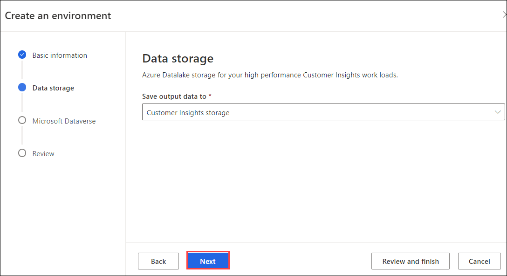
   
   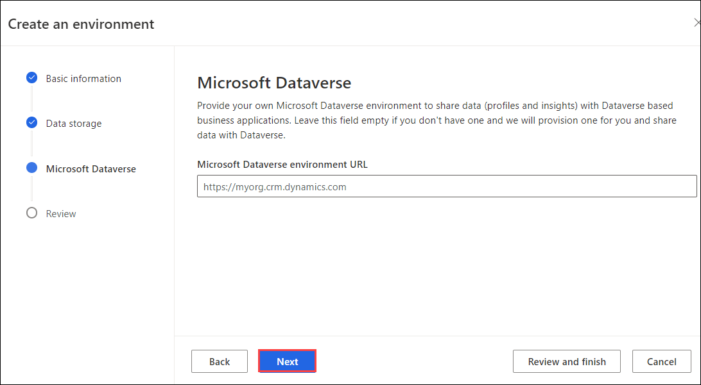
   
5. Review all the information in **Review** pane and click on **Create**. Wait until the environment is created.

    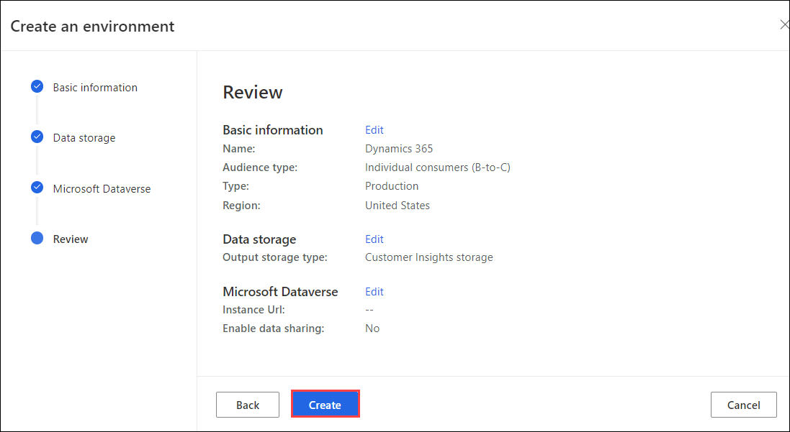

## Step 2: Load CustomerDemographics sample dataset to Customer Insights

1.  Go to the Data… Data sources tab and click **Add data source**

    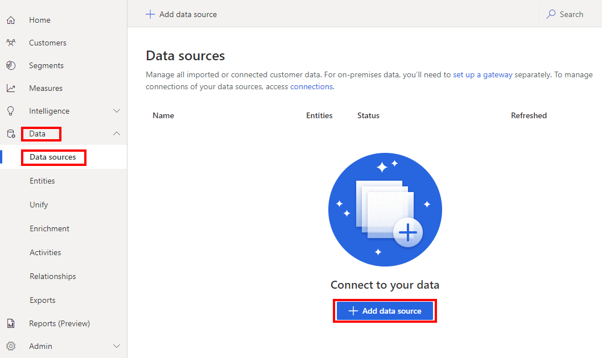

1.  Choose “Microsoft Power Query” and enter a dataset name **CustomerDemographics** and click **Next**.

    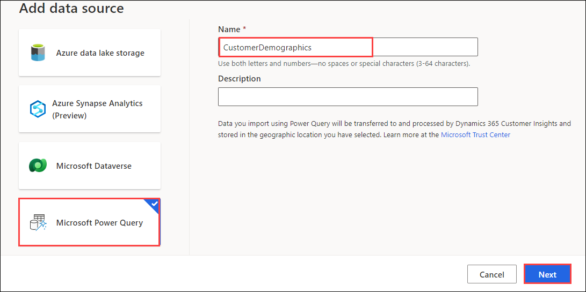

1.  Search for **Web** and choose **Web API** which is a quick way to import a
    dataset from a public website. (Your actual business data could come
    from any other type of data source which Power Query Online supports.)

    

1.  Paste in the following URL and click Next:

    <https://raw.githubusercontent.com/ArtisConsulting/customer-insights-azure-data-workshop/main/SampleData/CustomerDemographics.csv>

    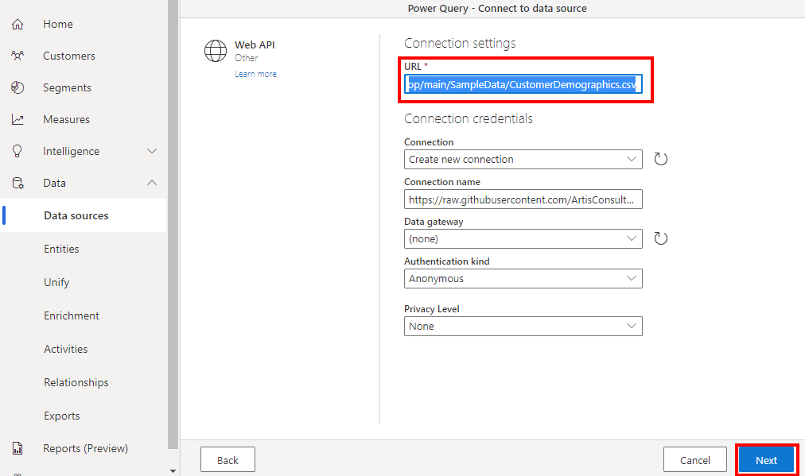
    
1.  Choose **Transform data**.

    
   

1.  Click the Transform tab at the top of the Power Query screen and then click **Use first row as headers**

    

1.  Confirm the column names read customerID, gender, etc. instead of
    Column1, Column2, etc.

    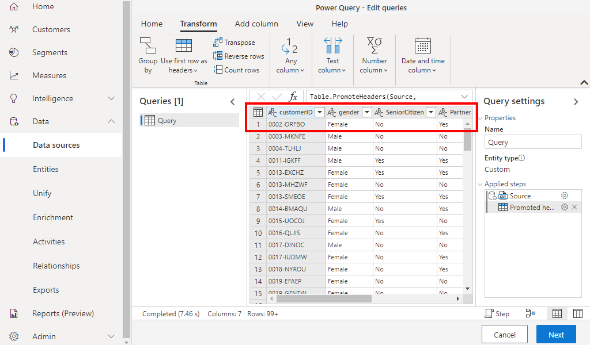
    
1.  Change the query name to **CustomerDemographics**. Click the **Next** button at
    the bottom of the screen.

    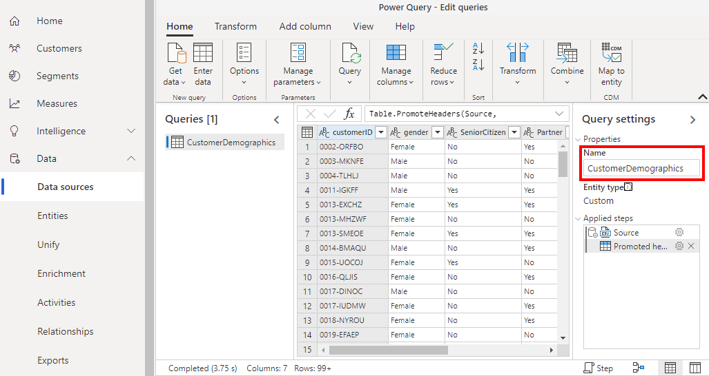

1.  Choose **refresh manually** (since this is a static sample dataset that
    won’t change) and click **Save**.

    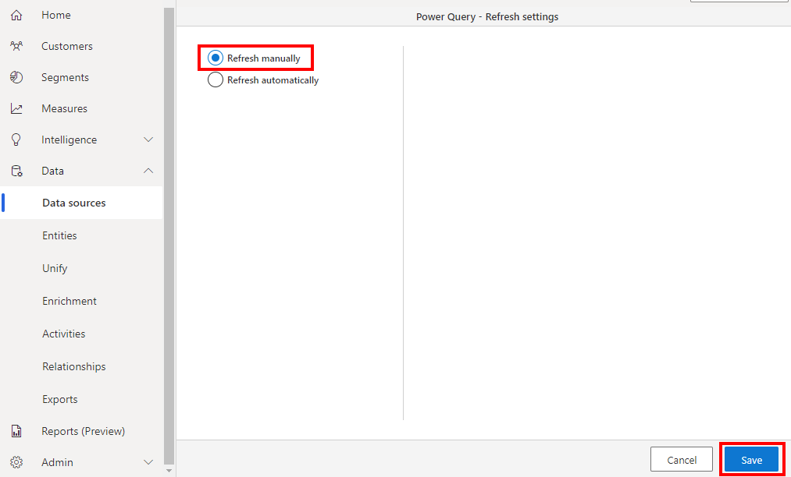

1.  While you wait for the CustomerDemographics data source to refresh,
    continue onto the next step.

    

## Step 3: Load CustomerServiceAttributes sample dataset to Customer Insights

1.  Click “Add data source”, "Microsoft Power Query", and name it
    **CustomerServiceAttributes** and click **Next**:

    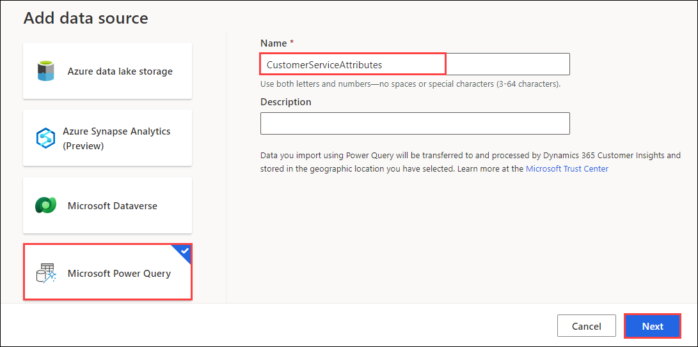

1.  Choose Web API like on the previous data source and then paste in the
    following URL and accept the existing connection since this data source is from the same
    website.

    <https://raw.githubusercontent.com/ArtisConsulting/customer-insights-azure-data-workshop/main/SampleData/CustomerServiceAttributes.csv>

    

1.  Click **Transform data**:

    

1.  On the Transform tab click **User first row as headers**:

    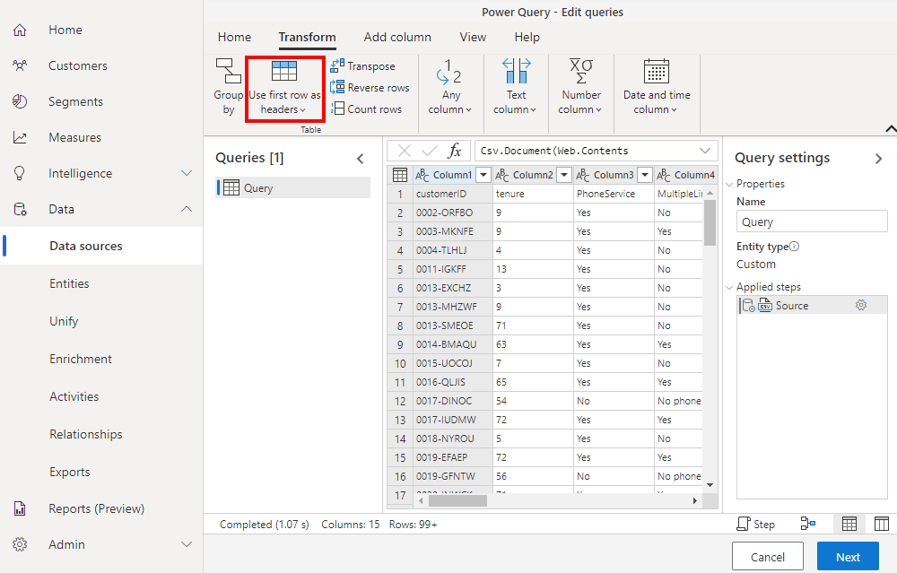

1.  Confirm the column headers now say customerID, tenure, PhoneService,
    etc.

    

1.  Left click on the ABC icon next to the tenure column header and choose
    **Whole number** to convert this column to an integer data type.

    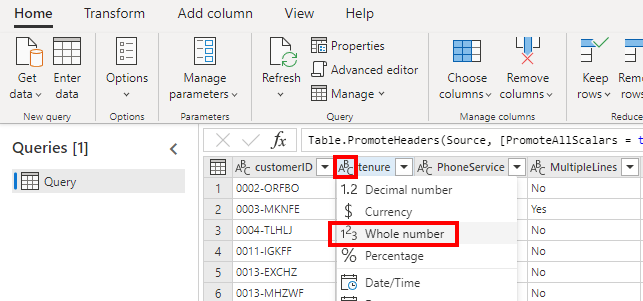

1.  Rename the query to **CustomerServiceAttributes** and then click the
    **Next** button at the bottom of the screen.

    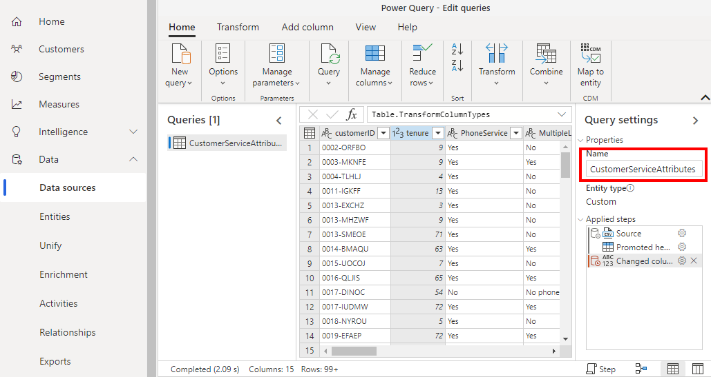

1.  Choose to refresh manually and click **Save**.

    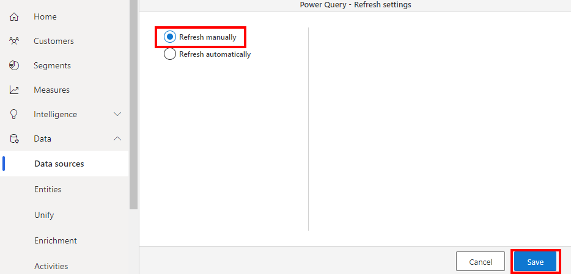

## Step 4: Ensure entities are loaded

1.  Once the data sources are done refreshing (it takes approximately 5
    minutes), go to the **Entities** tab and click each entity:

    

1.  On the Data tab for each entity, ensure that rows have been loaded and
    are visible. If no rows are shown, go back to the **Data sources** left
    nav and refresh the data sources again.

    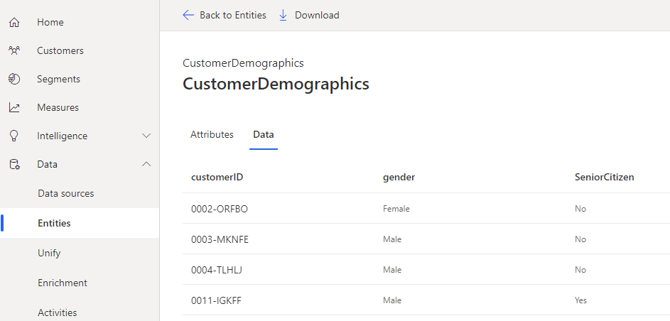

# Exercise 2: Unify customer entities

In this section you will map, match and merge your sample customer
entities in your Dynamics 365 Customer Insights environment. This step
is a prerequisite for later steps and labs.

## Step 1: Map fields in your customer entities

1.  On the Data… Unify left nav, click **+ Select entities and fields** on the Map tab:

    

1.  Click the checkboxes next to the two entities you wish to map then click
    **Apply**:

    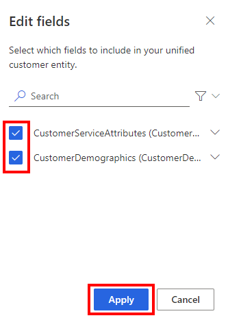

1.  Click the **CustomerDemographics** entity. Because “intelligent mapping” is
    selected, it will have already set the Type on the Country, customerID,
    gender and zip columns. Set the primary key to **customerID**.

    

1.  Click on the **CustomerServiceAttributes** entity. Set the primary key to
    **customerID**. Notice the intelligent mapping has incorrectly categorized
    the PhoneService column as this column indicates whether this telco
    customer has phone service or not. Dropdown the Type dropdown next to
    PhoneService and choose the blank value to blank out the Type on this
    column. Then click the **Save** button at the top of the page and click on **Next**.

    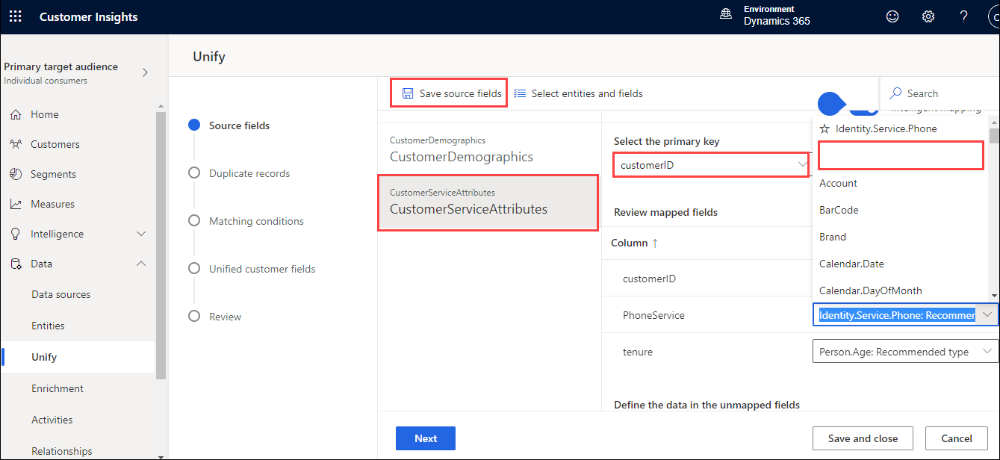

## Step 2: Match your customer entities on customerID

1.  Choose **CustomerDemographics** to the first or primary entity. Choose
    **CustomerServiceAttributes** to be the second entity. Click Done.

    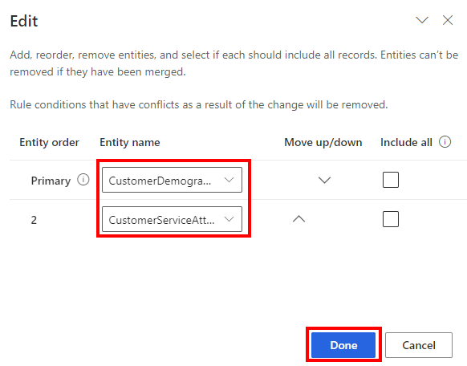

1.  Click the **Add Rule** button:

    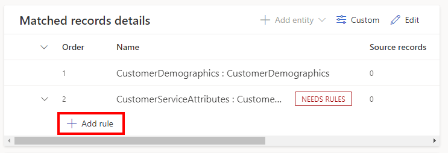

1.  Select **customerID** from both "Select field" dropdowns. Name this **rule** and
    click **Done**.

    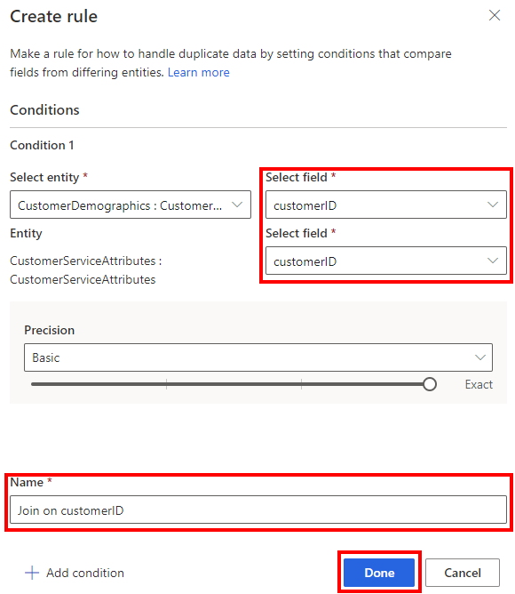

1.  Click the **Save and close** button at the bottom.

    

1.  Click on **Run matching conditions only** and wait while the matching runs. It takes approximately 5 minutes.

    

1.  When the matching is complete, validate that you have the proper matched
    record counts:

    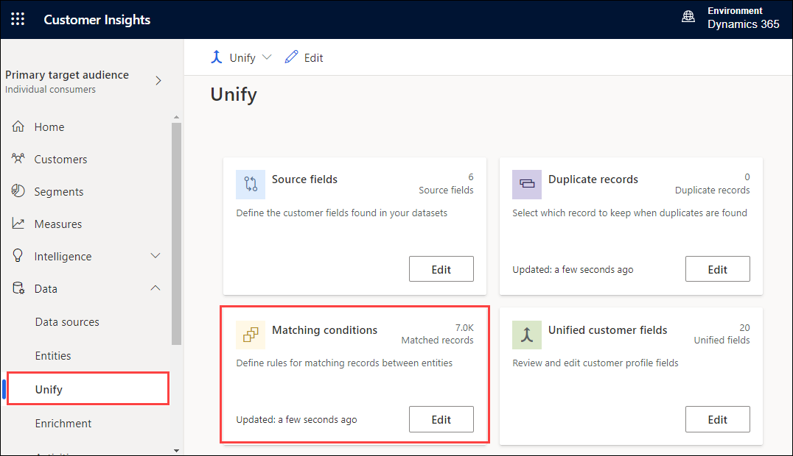

1.  If your own datasets contain duplication of data, then explore the [deduplication](https://docs.microsoft.com/en-us/dynamics365/customer-insights/audience-insights/match-entities#add-deduplication-rules) features of Dynamics 365 Customer Insights.

## Step 3: Merge your customer entities

1.  On the Merge tab, you have the opportunity to combine, ignore or rename
    any fields. For the sample dataset, nothing needs to be done
    except click **Unify customer profiles**.

    

1.  When merging is complete the screen will update with the current matched
    records count:

    

# Exercise 3: Enrich customer entities

In this section you will enrich your customer entities in your Dynamics
365 Customer Insights environment using external sources and services.

## Step 1: Enrich with Interest affinities

1.  On the Enrichment left nav click **Enrich my data** on the **Interests**
    tile to enrich your data with interest affinities from people in a
    similar demographic to your customers.

    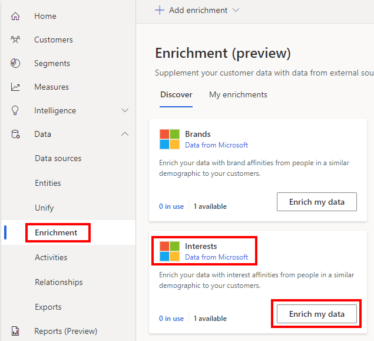

1.  On the overview tab, click **Next**

    

1.  On the Interests tab choose **Internet & Telecom** from the dropdown (or
    whatever industry makes sense for your business).

    

1.  Click the **+** icon next to Search Engines, Internet Service Plans,
    Teleconferencing, and Cable Services, then click **Next**.

    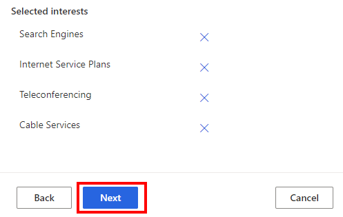

1.  On the Preferences tab, review the settings and click **Next**.

    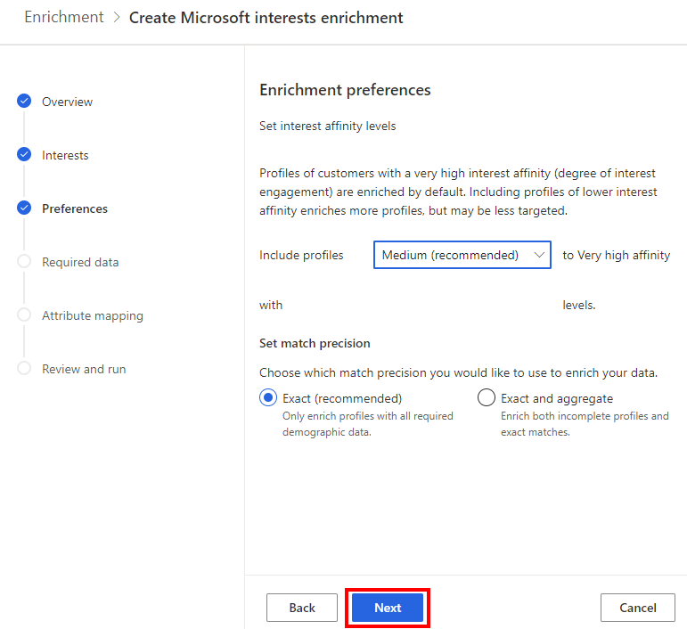

1.  On the Required data tab choose the **Customer** dataset and click **Next**:

    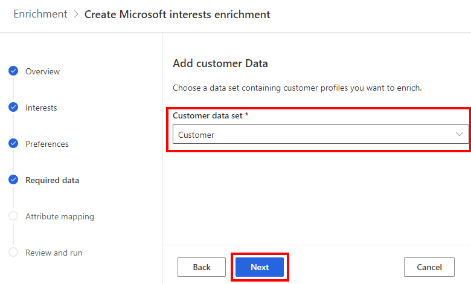

1.  On the Attribute mapping tab, follow the instructions. For the sample
    dataset, ensure the Gender, Country/Region, and Postal code fields are
    mapped to columns in your dataset. For you own dataset, follow the
    documentation on the [required
    fields](https://docs.microsoft.com/en-us/dynamics365/customer-insights/audience-insights/enrichment-microsoft#map-your-fields).
    Click Next.

    

1.  On the Review and run tab, review the settings, name your enrichment **MicrosoftInterestAffinityEnrichment** and
    click “**Save enrichment**”.

    

1.  Then click **Run**:

    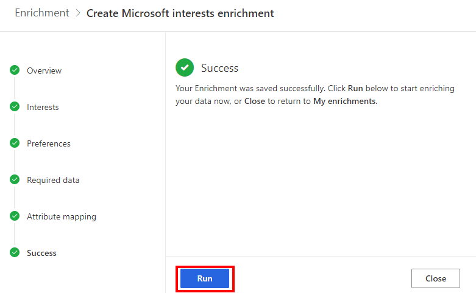
    
# Summary

In this lab, you loaded, mapped, merged and enriched customer entities
in Dynamics 365 Customer Insights. Later labs build on this work using
key Azure data services to add value to your customer data.

Next, go to [Lab 2](lab02.md).
